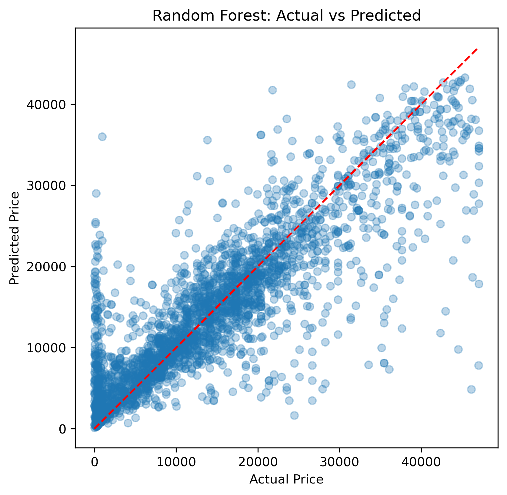
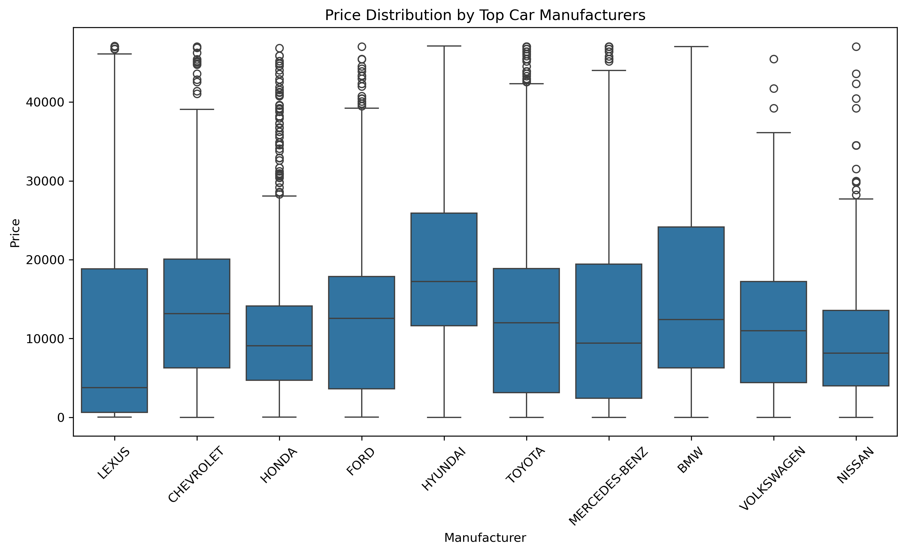

# 🚗 Car Price Prediction Challenge



A complete machine learning project that predicts used car prices using **Linear Regression**, **Decision Tree**, and **Random Forest** models — built on a real-world dataset sourced from Kaggle.

---

## 📌 Table of Contents

- [Project Overview](#project-overview)
- [Dataset](#dataset)
- [Project Structure](#project-structure)
- [Workflow](#workflow)
- [Exploratory Data Analysis](#exploratory-data-analysis)
- [Modeling & Results](#modeling--results)
- [Technologies Used](#technologies-used)
- [How to Run](#how-to-run)
- [Key Takeaways](#key-takeaways)

---

## Project Overview

This project tackles the problem of predicting used car prices based on vehicle attributes such as manufacturer, production year, engine volume, mileage, fuel type, and more.

The dataset comes with real-world messiness — disguised missing values, mixed-type columns, and extreme outliers — making this a practical exercise in **end-to-end data science**: from raw data to cleaned, engineered features and trained models.

> 📂 **Dataset Source:** [Kaggle – Car Price Prediction Challenge](https://www.kaggle.com/datasets/deepcontractor/car-price-prediction-challenge)

---

## Dataset

| Property | Details |
|---|---|
| Rows | 19,237 |
| Columns | 18 |
| Target Variable | `Price` (USD) |
| Source | Kaggle |

**Key Features:**
`Manufacturer`, `Model`, `Prod. year`, `Category`, `Leather interior`, `Fuel type`, `Engine volume`, `Mileage`, `Cylinders`, `Gear box type`, `Drive wheels`, `Doors`, `Wheel`, `Color`, `Airbags`, `Levy`

---

## Project Structure

```
├── Data/
│   └── car_price_prediction.csv       # Raw dataset
├── Notebook/
│   └── car-prediction-analysis.ipynb  # Full analysis notebook
├── Images/
│   ├── top_10_expensive_car_brands.png
│   ├── most_used_car_brands.png
│   └── random_forest_actual_vs_predicted.png
└── README.md
```

---

## Workflow

```
Raw Data → Data Cleaning → EDA → Feature Engineering → Modeling → Evaluation
```

### 1. Data Cleaning

The dataset had several hidden data quality issues that required careful handling:

- **`Levy`** — stored as object due to `"-"` placeholders representing missing values. Converted to numeric; ~30% were NaN and filled with the **median**.
- **`Mileage`** — contained `" km"` suffix strings. Stripped and converted to integer, then engineered into `Mileage per year`.
- **`Engine volume`** — contained `"Turbo"` text mixed with numeric values. The word `"Turbo"` was extracted into a new binary feature (`Turbo`), and the column was converted to float.
- **`Doors`** — encoded as `"04-May"`, `"02-Mar"` (Excel date artifacts). Remapped to actual door counts (`4`, `2`, etc.).
- **Price outliers** — IQR method used to remove 1,073 extreme price rows.
- Additional domain-based filtering removed impossible values (e.g., engine volume = 20L, mileage per year = 178 million km, car age = 81 years).

---

### 2. Feature Engineering

| New Feature | Source | Description |
|---|---|---|
| `Turbo` | `Engine volume` | Binary flag: 1 if turbo engine, 0 otherwise |
| `Car age` | `Prod. year` | `2024 - Prod. year` |
| `Mileage per year` | `Mileage` + `Car age` | Total mileage ÷ car age |

---

### 3. Encoding

Categorical features were encoded using **Label Encoding** to prepare them for tree-based and linear models.

---

## Exploratory Data Analysis

### Price Distribution

The price distribution is right-skewed, with the majority of cars priced between **$5,000 and $22,000**. After outlier removal, the max price was capped at **$47,120**.

---

### Correlation Heatmap

The heatmap reveals which numerical features correlate most with price. `Car age` and `Mileage` show negative correlations with price, while `Cylinders` and `Engine volume` show positive relationships — as expected.

---

### Outlier Detection

Boxplots across key numerical features (`Price`, `Levy`, `Engine volume`, `Mileage per year`, `Airbags`, `Cylinders`, `Car age`) confirm the presence of extreme values. These were either capped or removed using domain-knowledge thresholds.

---

### Top Car Manufacturers by Count



A breakdown of the most frequently listed manufacturers in the dataset, showing market composition in the used car listings.

---

### Fuel Type Distributio

Petrol dominates the listings, followed by hybrid vehicles. This distribution is used to understand feature prevalence before modeling.

---

## Modeling & Results

Three regression models were trained and evaluated on an **80/20 train-test split**.

### Model Comparison

| Model | Train R² | Test R² | Test MAE |
|---|---|---|---|
| Linear Regression | ~0.30 | ~0.30 | High |
| Decision Tree | ~0.99 | ~0.60 | Moderate |
| **Random Forest** | **0.8615** | **0.73** | **3,721** |

---

### Feature Importance (Random Forest)

The Random Forest model identified the most influential features for price prediction. Engine-related and age-related features consistently ranked highest.

---

### Linear Regression: Actual vs Predicted

Linear Regression struggled to capture the non-linear relationships in the data, resulting in a low R² of ~0.30 and significant scatter in predictions.

---

### Random Forest: Actual vs Predicted


The Random Forest model demonstrated significantly better alignment between actual and predicted prices, especially in the mid-price range.

---

## Technologies Used

| Tool | Purpose |
|---|---|
| Python 3.12 | Core language |
| Pandas | Data manipulation |
| NumPy | Numerical operations |
| Matplotlib / Seaborn | Visualization |
| Scikit-learn | Modeling & evaluation |
| Jupyter Notebook | Interactive analysis |

---

## How to Run

1. **Clone the repository**
   ```bash
   git clone https://github.com/your-username/car-price-prediction.git
   cd car-price-prediction
   ```

2. **Install dependencies**
   ```bash
   pip install pandas numpy matplotlib seaborn scikit-learn jupyter
   ```

3. **Launch the notebook**
   ```bash
   jupyter notebook Notebook/car-prediction-analysis.ipynb
   ```

4. **Ensure the dataset is in place**
   ```
   Data/car_price_prediction.csv
   ```

---

## Key Takeaways

- **Data quality matters more than model complexity** — significant effort went into uncovering hidden missing values and impossible records that would have silently degraded model performance.
- **Feature engineering pays off** — derived features like `Car age`, `Mileage per year`, and the `Turbo` binary flag added meaningful signal to the models.
- **Ensemble models generalize better** — Random Forest (Test R² = 0.73) significantly outperformed both Linear Regression (~0.30) and Decision Tree (~0.60 with signs of overfitting).
- **Outlier handling is nuanced** — both statistical methods (IQR) and domain knowledge (no car has a 20L engine or 178M km/year) were needed to clean the data properly.

---

## 📬 Contact

Feel free to reach out or open an issue if you have questions or suggestions for improving this project.
